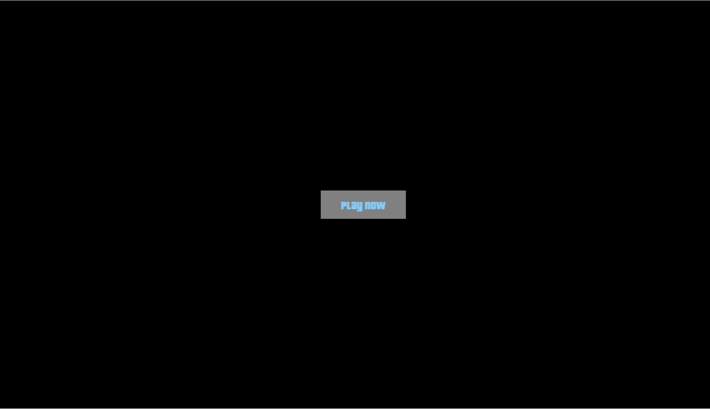
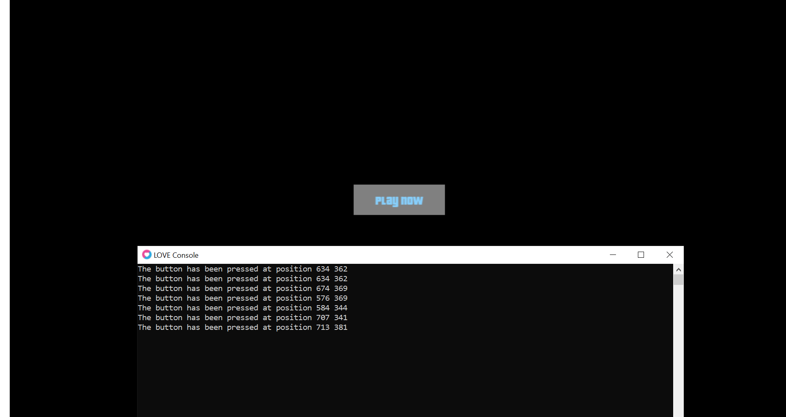
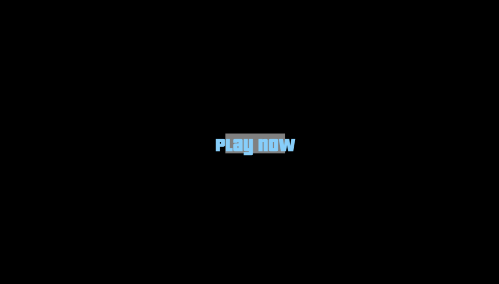

# LoveButton

A library to help you create interactive buttons in Love2d.
### How to download ?
<sup>First, you have to download the library's source code on github, extract it to your game's directory, then require it using the following syntax:</sup>
```lua
local Button = require("libaryDirectory/Button")
```
### Create a button

<sup>To create a button, we use the following syntax:</sup>
```lua
local Button = require("libaryDirectory/Button")

function love.load()
  SCREEN_WIDTH, SCREEN_HEIGHT = love.graphics.getWidth(), love.graphics.getHeight()
  font = love.graphics.newFont("fonts/pricedown bl.otf", 20)
  button1 = Button:new(SCREEN_WIDTH / 2 - (150 / 2), SCREEN_HEIGHT / 2 - (50 / 2), 150, 50, love.graphics.newText(font, "Play Now"), {128, 128, 128}, {135, 206, 250})
end

-- The 1st parameter is the x position of the button.
-- The second parameter is the y position of the button.
-- The third parameter is the width of the button.
-- The 4th parameter is the height of the button.
-- The 5th parameter is the title, generated by love.graphics.newText().
-- The 6th parameter is the color of the button.
-- The 7th parameter is the color of the title.
```
### Draw button

<sup>After creating the button, you don't see it on the screen right? That's because you haven't drawn it yet, draw it at the love.draw() function like this: </sup>
```lua
local Button = require("libaryDirectory/Button")

function love.load()
  SCREEN_WIDTH, SCREEN_HEIGHT = love.graphics.getWidth(), love.graphics.getHeight()
  font = love.graphics.newFont("fonts/pricedown bl.otf", 20)
  button1 = Button:new(SCREEN_WIDTH / 2 - (150 / 2), SCREEN_HEIGHT / 2 - (50 / 2), 150, 50, love.graphics.newText(font, "Play Now"), {128, 128, 128}, {135, 206, 250})
end

function love.draw()
  button1:draw()
end
```
<sup>After running the program, this is the result: </sup>

### Active

<sup>A button has a property called ```active```, it has no specific function, you can use it to mark the button has been pressed or not, default value is ```true```.</sup>
<br/>
<sup>Set the value for the ```active``` attribute: </sup>
```lua
local Button = require("libaryDirectory/Button")

function love.load()
  SCREEN_WIDTH, SCREEN_HEIGHT = love.graphics.getWidth(), love.graphics.getHeight()
  font = love.graphics.newFont("fonts/pricedown bl.otf", 20)
  button1 = Button:new(SCREEN_WIDTH / 2 - (150 / 2), SCREEN_HEIGHT / 2 - (50 / 2), 150, 50, love.graphics.newText(font, "Play Now"), {128, 128, 128}, {135, 206, 250})
  button1:setActive(true) -- Here
end

function love.draw()
  button1:draw()
end
```

### Callback

<sup>To add a callback function, you can add it using the following syntax: </sup>
```lua
local Button = require("libaryDirectory/Button")

function love.load()
  SCREEN_WIDTH, SCREEN_HEIGHT = love.graphics.getWidth(), love.graphics.getHeight()
  font = love.graphics.newFont("fonts/pricedown bl.otf", 20)
  button1 = Button:new(SCREEN_WIDTH / 2 - (150 / 2), SCREEN_HEIGHT / 2 - (50 / 2), 150, 50, love.graphics.newText(font, "Play Now"), {128, 128, 128}, {135, 206, 250})
  button1:setCallback(function(x, y)
    print("The button has been pressed at position " .. x .. " " .. y)
  end)
end

function love.draw()
  button1:draw()
end
```

<sup>When you press the button nothing happens that's because you haven't called the function to check the button click event. </sup>

```lua
local Button = require("libaryDirectory/Button")

function love.load()
  SCREEN_WIDTH, SCREEN_HEIGHT = love.graphics.getWidth(), love.graphics.getHeight()
  font = love.graphics.newFont("fonts/pricedown bl.otf", 20)
  button1 = Button:new(SCREEN_WIDTH / 2 - (150 / 2), SCREEN_HEIGHT / 2 - (50 / 2), 150, 50, love.graphics.newText(font, "Play Now"), {128, 128, 128}, {135, 206, 250})
  button1:setCallback(function(x, y)
    print("The button has been pressed at position " .. x .. " " .. y)
  end)
end

function love.draw()
  button1:draw()
end

function love.mousepressed(x, y, button, istouch, presses)
  button1:checkClick(x, y)
end
```
<sup>Here is the result: </sup>


### Some note

<sup>If the length of the button is not enough to hold the text, this will happen: </sup>


<sup>So be careful.</sup>
